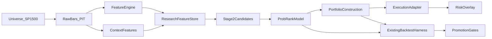
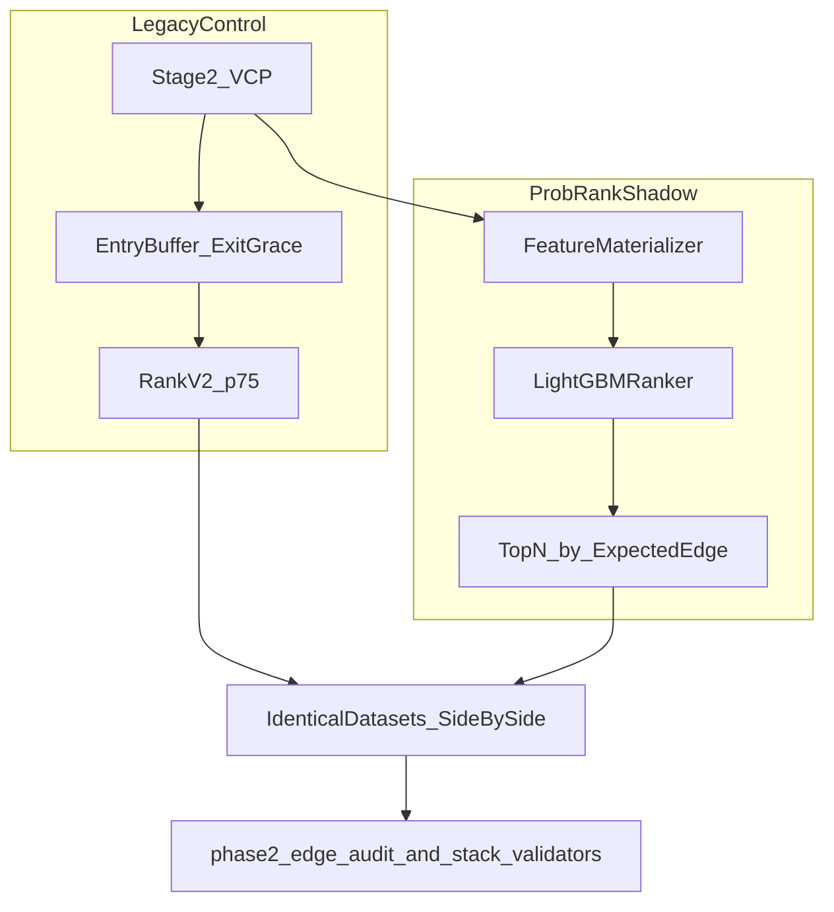

# Probabilistic Ranking Research Architecture

> Technical design for evolving TradingBot from rule-based gating into a
> probabilistic ranking research platform. **Design only — no implementation
> begins until this document is approved as internally consistent.**

| Field | Value |
|---|---|
| Status | Design approved 2026-07-17; Phases B–F done; **go/no-go LOCKED 2026-07-18 → KEEP SHADOW** |
| Created | 2026-07-17 |
| Owner | Quant research / signal edge (P0) |
| Canonical path | `schwab_skill/docs/PROBABILISTIC_RANKING_RESEARCH_ARCHITECTURE.md` |
| Wiki digest | `wiki/probabilistic-ranking-research-architecture.md` |
| Locked verdict | **KEEP SHADOW** (not LIVE, not KILL) — see §Locked go/no-go |

---

## Locked go/no-go (2026-07-18) — do not re-litigate

**Verdict: KEEP SHADOW**

Frozen primary contract: top-N/day with **N=5** vs rank-v2 on purged / OOS
control_legacy evidence (`disagreement_attribution.json`). Secondary p75 CF
and live ledger are context only. LIVE floors unchanged (PF mean ≥ 1.20,
worst-era ≥ 1.00). Do **not** set `PROB_RANK_MODE=live` from this lock.

| Arm (top-5/day, 954 cohorts) | PF mean | Worst-era | recent_current PF |
|---|---:|---:|---:|
| Prob-rank (`2c9efe271d`) | **1.207** | **1.026** | **1.061** |
| Rank-v2 | **1.204** | **1.024** | **1.138** |

Attribution: only_prob PF 1.209 vs only_v2 1.220 → artifact verdict **near_tie**
(gap &lt; 0.03). Default on near-tie = KEEP SHADOW.

Secondary (p75 CF, same model): prob **1.411 / 1.068** vs rank-v2 **1.062 / 0.926**
→ research `promote_shadow` only — different selection policy than live top-5.

Live ledger (`prob_rank_shadow_evidence/`): **42** rows (2 live Stage-B + 40 CF
day seeds); model `2c9efe271d`; no broken scans. Ledger alone is not a LIVE gate.

| Will | Won't |
|---|---|
| Keep `PROB_RANK_MODE=shadow` + model `lgbm_ret_40d_fwd_2c9efe271d` | Enable `live`; train new model families; weaken LIVE floors; re-argue from p75 alone |

**Single next action:** Accumulate live (non-CF) Stage-B shadow ledger rows under
normal ops; reopen LIVE discussion only if that live sample shows a decisive
top-5/day edge vs rank-v2 (not on secondary p75).

Artifact: `validation_artifacts/prob_rank_shadow_evidence/go_nogo_verdict_2026-07-18.json`

---

## 0. Purpose and non-goals

### Purpose

Redesign the **research framework** so every future experiment produces higher-quality
evidence about *why* some Stage-2 candidates outperform others. Ranking already
separates quality; hand-tuned binary filters and fixed blends do not explain why.

### Non-goals (this design / migration)

- Do **not** optimize a single historical backtest for maximum PF.
- Do **not** add additional hard filters as the primary research lever.
- Do **not** use ML to invent buy signals outside the candidate generator.
- Do **not** treat ~25% trade retention as success without a capacity/EV thesis.
- Do **not** replace the existing backtest harness, multi-era runner, or PF floors.

### Evidence that motivates the redesign

From `BACKTEST_CATALOG.md` (Schwab-only five-era, 2026-07-17):

| Layer | PF mean | Worst-era PF | Retention |
|---|---:|---:|---:|
| Bare (`stage2_only_aug`) | 1.162 | 1.032 | 100% |
| Stack (1% buffer + exit grace 15/40) | 1.212 | 1.037 | ~full |
| Rank-v2 p75 on stack | 1.249 | 1.120 | ~25% |

**Interpretation:** the ranking layer identifies higher-quality trades; the underlying
signal definition itself is not yet clearing bare-signal promotion (PF mean ≥ 1.20).
The research platform must learn continuous relationships that drive that separation.

---

## 1. Locked architecture decisions

These choices are closed for v1 so implementation does not re-open forks:

| # | Decision | Rationale |
|---|---|---|
| 1 | **Candidate generation stays rule-based** (Stage 2; VCP may remain shadow). ML ranks existing candidates only. | Preserves entry definition; matches “do not invent buys.” |
| 2 | **Two storage tiers, one schema contract** — research Parquet warehouse + operational SQL `feature_store`. | Experiments need dense PIT panels; live scans need cheap append logging. |
| 3 | **Primary model:** LightGBM (regression + optional ranking objective). XGBoost/CatBoost = ablations only. | Strong tabular baseline; TreeSHAP-friendly. |
| 4 | **Primary target:** `ret_40d_fwd`; strategy join uses `net_return` / R-multiple. Secondary: `y_up_40d`, `drawdown_40d`. | Aligns with advisory label horizons and max-hold. |
| 5 | **Research selection:** daily cross-sectional top-N by expected edge. Legacy `RANK_FILTER_V2` p75 is the **control**, not the research objective. | Isolates ranking quality from hard percentile mimicry. |
| 6 | **Plugin mode:** `PROB_RANK_MODE` ∈ `{off, shadow, live}` — never skip shadow. | Same discipline as Regime v2 / Correlation Guard. |
| 7 | **Promotion:** PF mean ≥ 1.20 and worst-era PF ≥ 1.00 remain **hard floors**. Composite promotion score **ranks** alternatives that already clear floors. | Prevents PF-max overfitting while preserving current gates. |

### Philosophy shift

| Legacy (rule chain) | Target (probabilistic) |
|---|---|
| Signal → volume filter → breakout buffer → entry/exit filters → trade | Universe → features → context → probability model → portfolio → execution → risk |
| Binary pass/fail | Continuous feature vector + scores |
| Independent “should we trade?” | Cross-sectional “which candidates today?” |
| Static sizing | Edge × confidence / vol (after ranking lift is isolated) |

---

## 2. Architecture overview



### Component map (planned modules — not yet implemented)

| Component | Planned home | Role |
|---|---|---|
| Feature registry | `research_store/feature_registry.json` + loader | Schema version, enabled flags, ablation groups |
| Feature engine | `research/feature_engine/` (new) | Continuous feature computation from OHLCV + context |
| Research warehouse | `schwab_skill/research_store/` (gitignored Parquet) | PIT panel source of truth for experiments |
| Ops feature store | `feature_store.py` (extend) | Live-scan rows using **same feature names** |
| Dataset builder | `scripts/build_rank_dataset.py` (new) | Join features → labels → frozen training matrix |
| Trainer | `scripts/train_prob_rank_model.py` (new) | Walk-forward LightGBM + SHAP + report package |
| Inference adapter | hook in `signal_scanner` / `backtest` | Attach `prob_rank_*` fields under `PROB_RANK_MODE` |
| Experiment reports | `validation_artifacts/prob_rank/<run_id>/` | Metrics, plots metadata, per-era tables |
| Promotion | extend `experiment_registry` + validators | Composite score after hard floors |

### Coexistence with legacy stack



---

## 3. Feature store design

### 3.1 Two tiers, one contract

| Tier | Path / tech | Write path | Read path | Authority |
|---|---|---|---|---|
| **Research warehouse** | `schwab_skill/research_store/` Parquet (gitignored) | Offline materializer over historical bars | Train / ablate / counterfactual | **Source of truth for experiments** |
| **Operational SQL** | `feature_store` table via `feature_store.py` | Live scanner Stage A/B | Evolve / cockpit / sparse live feedback | Ops logging; must not diverge on feature **names** |

Wiki note: `wiki/feature-store.md` previously described a Parquet layout that the
code did not implement. Correct split:

- SQL `feature_store` = live scan events (today).
- `research_store/` Parquet = research panel (this design).

### 3.2 Row identity and versioning

Primary key for research rows:

```text
(asof_date, ticker, candidate_set_version, feature_schema_version)
```

| Field | Meaning |
|---|---|
| `asof_date` | Decision date (features use bars with `t ≤ asof_date` only) |
| `ticker` | Symbol |
| `candidate_set_version` | e.g. `stage2_pass_v1`, `stage2_plus_fails_v1` |
| `feature_schema_version` | Integer bump on any additive/breaking feature change |
| `bar_provider` | `schwab` / `yfinance` / … lineage |
| `feature_coverage` | Fraction of non-null features in the active schema |
| `raw_features_json` | Optional overflow for ad-hoc fields |

Layout (research):

```text
research_store/
  feature_registry.json
  panels/
    schema_v{N}/
      features/year={YYYY}/part-*.parquet
      labels/year={YYYY}/part-*.parquet
      predictions/model={id}/year={YYYY}/part-*.parquet
  datasets/
    {dataset_id}.parquet          # frozen train matrices
  models/
    {model_id}/artifact.json + booster files
```

### 3.3 Feature registry entry shape

Every feature supports:

```json
{
  "name": "rvol_percentile_60d",
  "dtype": "float64",
  "category": "volume",
  "description": "Percentile of volume_ratio vs prior 60 sessions",
  "formula": "percentile_rank(volume / sma(volume,50), window=60)",
  "data_source": "ohlcv",
  "pit_safe": true,
  "enabled": true,
  "weight": null,
  "ablation_group": "volume_continuous",
  "owner": "research",
  "status": "reuse|new|deferred",
  "coverage_risk": "low|medium|high"
}
```

- `weight` is for linear baselines only; tree models ignore it.
- `enabled=false` excludes the column from training matrices without deleting history.
- Binary features are forbidden when a continuous representation exists.

### 3.4 Candidate set policy (v1)

| Set | Included | Use |
|---|---|---|
| `stage2_pass_v1` (default) | Tickers passing Stage 2 on `asof_date` | Training + ranking |
| `stage2_plus_fails_v1` (optional) | Passes + Stage-2 fails | Coverage / gate ablation only |
| Full SP1500×day panel | Deferred to Phase 1b | Cost expansion |

v1 does **not** require a dense all-names daily panel.

---

## 4. Feature catalog

Status legend: **reuse** = already computed somewhere in the stack; **new** = must be
built; **deferred** = no reliable PIT source today — do not invent zeros.

### 4.1 Trend / structure

| name | dtype | status | source / notes | enabled_default | coverage_risk |
|---|---|---|---|---|---|
| `sma_20` | float | new | Rolling close mean 20 | true | low |
| `sma_50` | float | reuse | `stage_analysis.add_indicators` | true | low |
| `sma_150` | float | reuse | same | true | low |
| `sma_200` | float | reuse | same | true | low |
| `sma_20_slope` | float | new | OLS slope / price (N≈20) | true | low |
| `sma_50_slope` | float | new | OLS slope / price | true | low |
| `sma_200_slope` | float | reuse→extend | Stage-2 upward check → continuous | true | low |
| `dist_sma50_pct` | float | reuse | advisory `close_vs_sma50_pct` | true | low |
| `dist_sma200_pct` | float | reuse | advisory `close_vs_sma200_pct` | true | low |
| `pct_from_52w_high` | float | reuse | Stage-2 / score components | true | low |
| `stage_score` | float | new | Continuous Stage-2 quality (0–1), not pass/fail | true | low |
| `weinstein_score` | float | new | Blend of SMA stack + slope + 52w distance | true | low |
| `rs_percentile_252d` | float | new | Stock return rank vs universe | true | medium |
| `rs_acceleration` | float | new | Δ RS percentile over 21d | true | medium |
| `rs_trend_persistence` | float | new | Fraction of days RS improving in 63d | true | medium |

### 4.2 Volatility

| name | dtype | status | source / notes | enabled_default | coverage_risk |
|---|---|---|---|---|---|
| `atr_14` | float | reuse | `stage_analysis` ATR-14 | true | low |
| `atr_pct` | float | reuse | advisory feature | true | low |
| `atr_percentile_126d` | float | new | Rank of `atr_pct` in 126d | true | low |
| `atr_expansion_rate` | float | new | `atr_pct / atr_pct_sma20 - 1` | true | low |
| `atr_contraction_duration` | float | new | Days `atr_pct` below its 63d median | true | low |
| `realized_vol_20d` | float | new | Stdev of log returns × √252 | true | low |
| `hist_vol_percentile_252d` | float | new | Percentile of realized vol | true | low |
| `bb_bandwidth_20` | float | new | (upper−lower)/mid Bollinger 20,2 | true | low |
| `compression_score` | float | new | Blend of BB bandwidth + ATR contraction | true | low |
| `vol_contraction_score` | float | new | Continuous VCP-style volume/range dry-up | true | low |

### 4.3 Volume

| name | dtype | status | source / notes | enabled_default | coverage_risk |
|---|---|---|---|---|---|
| `volume_ratio` | float | reuse | latest / avg_vol_50 | true | low |
| `avg_vcp_volume_ratio` | float | reuse | VCP dry-up metric | true | low |
| `vcp_contraction_days` | float | reuse | Count (treat as continuous) | true | low |
| `rvol_percentile_60d` | float | new | Percentile of volume_ratio | true | low |
| `volume_anomaly_score` | float | new | Z-score of log volume vs 60d | true | low |
| `dollar_volume` | float | new | close × volume | true | low |
| `dollar_volume_percentile_60d` | float | new | Cross-section or time percentile | true | low |
| `accumulation_score` | float | new | Up-day volume bias over 20d | true | low |
| `distribution_score` | float | new | Down-day volume bias over 20d | true | low |
| `obv_slope_20d` | float | new | OLS slope of OBV | true | low |
| `volume_trend_20d` | float | new | Slope of volume SMA | true | low |
| `volume_score` | float | new | Composite continuous replacement for “vol > 120%” | true | low |

### 4.4 Breakout quality

| name | dtype | status | source / notes | enabled_default | coverage_risk |
|---|---|---|---|---|---|
| `entry_timing_buffer_pct` | float | reuse | Entry-timing shadow metrics | true | low |
| `breakout_confirmed` | int | reuse | Metadata only — not a ranking feature | false | low |
| `breakout_distance_pct` | float | new | % above pivot / 52w-derived level | true | low |
| `breakout_velocity` | float | new | Return over 3–5d into breakout | true | low |
| `dist_above_pivot_pct` | float | new | Pivot = recent consolidation high | true | medium |
| `dist_anchored_vwap_pct` | float | new | Distance to AVWAP from base start | true | medium |
| `breakout_persistence` | float | new | Days close held above pivot | true | medium |
| `breakout_quality_score` | float | new | Composite continuous score | true | medium |
| `failed_breakout_attempts_63d` | float | new | Count of failed pierces | true | medium |
| `prior_resistance_touches_63d` | float | new | Touches of pivot band | true | medium |

### 4.5 Momentum

| name | dtype | status | source / notes | enabled_default | coverage_risk |
|---|---|---|---|---|---|
| `ret_5d_prev` | float | reuse | advisory | true | low |
| `ret_10d_prev` | float | new | Prior 10d return | true | low |
| `ret_20d_prev` | float | reuse | advisory | true | low |
| `ret_60d_prev` | float | new | | true | low |
| `ret_120d_prev` | float | new | | true | low |
| `ret_252d_prev` | float | new | | true | low |
| `momentum_acceleration` | float | new | `ret_20d - ret_60d/3` style | true | low |
| `residual_momentum` | float | new | Stock ret − β×benchmark ret | true | medium |

### 4.6 Liquidity

| name | dtype | status | source / notes | enabled_default | coverage_risk |
|---|---|---|---|---|---|
| `adv_20d` | float | reuse | Used in liquidity guards | true | low |
| `adv_percentile` | float | new | Cross-section ADV rank | true | medium |
| `dollar_adv_20d` | float | new | | true | low |
| `bid_ask_spread_proxy` | float | deferred | Needs quote history PIT | false | high |
| `float_shares` | float | deferred | Needs PIT fundamental feed | false | high |
| `market_cap` | float | deferred | yfinance snapshot ≠ PIT | false | high |
| `institutional_ownership` | float | deferred | No PIT source in stack | false | high |
| `insider_ownership` | float | deferred | No PIT source in stack | false | high |

### 4.7 Quality / fundamentals

| name | dtype | status | source / notes | enabled_default | coverage_risk |
|---|---|---|---|---|---|
| `pead_surprise_pct` | float | reuse | `earnings_signal` | true | medium |
| `forensic_sloan` | float | reuse | `forensic_accounting` | true | medium |
| `forensic_beneish` | float | reuse | same | true | medium |
| `forensic_altman` | float | reuse | same | true | medium |
| `sec_risk_score` | float | reuse | advisory mapping from SEC tags | true | medium |
| `earnings_distance_days` | float | reuse | feature_store / event risk | true | medium |
| `estimate_revisions` | float | deferred | No PIT revisions feed | false | high |
| `revenue_surprise` | float | deferred | Unless Finnhub exposes PIT | false | high |
| `sales_acceleration` | float | deferred | | false | high |
| `eps_growth` | float | deferred | | false | high |
| `roe` | float | deferred | Point-in-time unknown | false | high |
| `gross_margin_trend` | float | deferred | | false | high |

### 4.8 Technical structure (bases / VCP continuous)

| name | dtype | status | source / notes | enabled_default | coverage_risk |
|---|---|---|---|---|---|
| `vcp_score` | float | new | Continuous replacement for VCP hard gate | true | low |
| `base_duration_days` | float | new | Length of consolidation window | true | medium |
| `base_depth_pct` | float | new | Drawdown from base high to low | true | medium |
| `pullback_quality` | float | new | Orderly vs chaotic pullback score | true | medium |
| `gap_stats_20d` | float | new | Gap frequency / magnitude | true | low |
| `trendline_proximity_pct` | float | new | Distance to fitted support | true | medium |
| `volume_profile_location` | float | deferred | Needs VP engine | false | high |

### 4.9 Market context (every trade / candidate)

| name | dtype | status | source / notes | enabled_default | coverage_risk |
|---|---|---|---|---|---|
| `spy_above_sma200` | float | reuse | Regime gate input (store as 0/1 float ok as context) | true | low |
| `spy_sma200_slope` | float | new | Continuous | true | low |
| `spy_momentum_63d` | float | reuse→extend | sector_regime / REGIME_V2 inputs | true | low |
| `qqq_momentum_63d` | float | new | | true | low |
| `iwm_momentum_63d` | float | new | Russell proxy | true | low |
| `vix_percentile_252d` | float | new | From VIX series already used in REGIME_V2 | true | medium |
| `regime_v2_score` | float | reuse | `sector_strength.compute_regime_v2_*` | true | medium |
| `breadth_pct_above_50` | float | new | Universe or SPX proxy | true | medium |
| `breadth_pct_above_200` | float | new | | true | medium |
| `new_high_new_low_ratio` | float | deferred | Needs breadth feed | false | high |
| `yield_curve_spread` | float | deferred | Needs rates feed | false | high |
| `credit_spread` | float | deferred | Needs credit feed | false | high |

### 4.10 Sector / industry context

| name | dtype | status | source / notes | enabled_default | coverage_risk |
|---|---|---|---|---|---|
| `sector_etf` | category | reuse | `get_ticker_sector_etf` | true | medium |
| `sector_rel_21d` | float | reuse | sector ETF − SPY (advisory) | true | medium |
| `sector_winning` | float | reuse | Gate metadata; prefer continuous RS | false | medium |
| `stock_vs_sector_rs_63d` | float | new | Stock ret − sector ETF ret | true | medium |
| `sector_momentum_63d` | float | new | Sector ETF return | true | low |
| `sector_breadth_above_50` | float | new | % of mapped names above SMA50 | true | high |
| `sector_breadth_above_200` | float | new | | true | high |
| `industry_etf` | category | deferred | Industry map incomplete | false | high |
| `industry_rs_63d` | float | deferred | Needs industry ETF map | false | high |

Example intent: ASYS candidates should know SMH/SOXX (and industry when mapped)
**before** ranking — implemented as continuous RS/momentum features, not a hard sector gate.

### 4.11 Legacy scores (features, not gates)

| name | dtype | status | notes | enabled_default |
|---|---|---|---|---|
| `signal_score` | float | reuse | Hand score 0–100 | true |
| `pts_52w` / `pts_volume` / `pts_mirofish` | float | reuse | Components; `pts_sma` often zeroed | true |
| `edge_score` / `reliability_score` / `execution_score` | float | reuse | Score stack | true |
| `composite_score` / `rank_score` / `rank_score_v2` | float | reuse | Control / baseline features | true |
| `p_up_calibrated` / `ev_10d` | float | reuse | | true |
| `advisory_p_up_10d` | float | reuse | From `advisory_model` — **baseline, not production ranker** | true |
| `miro_continuation_prob` / `miro_bull_trap_prob` | float | reuse | | true |
| `trend_strength_score` | float | new | Continuous replacement for trend yes/no | true |

**Hard rule:** Stage2/VCP pass flags may label the candidate set; they must not be
fed as ranking features that merely recreate the gate.

---

## 5. Data flow

### 5.1 End-to-end

```text
Raw OHLCV (market_data / multi-era cache)
        │
        ▼
FeatureEngine (PIT, schema_version N)
        │
        ├─► research_store/panels/.../features/*.parquet
        │
        ├─► ContextFeatures (SPY/QQQ/IWM/VIX/sector)
        │
        ▼
Candidate filter (Stage 2 pass → stage2_pass_v1)
        │
        ▼
Label join
  • Forward bar returns: ret_{5,10,20,40}d_fwd, y_up_*, drawdown_*
  • Strategy outcomes: net_return, mfe, mae, exit_reason (from trades)
        │
        ▼
Frozen dataset parquet (dataset_id)
        │
        ▼
Walk-forward LightGBM → model artifact
        │
        ▼
Inference: E[r], E[downside], confidence, expected_pf_proxy, SHAP top±
        │
        ├─ shadow: attach to signals/trades (no selection change)
        ├─ research: top-N portfolio construction → backtest.py
        └─ live (only after promotion): selection replaces/augments rank_v2
```

### 5.2 Label join contracts

| Label family | Source | Join key |
|---|---|---|
| Forward returns | Bars after `asof_date` | `(ticker, asof_date)` |
| Strategy PnL | Multi-era chunks / `include_all_trades` | `(ticker, entry_date)` ≈ `asof_date` |
| Advisory-compatible | Same horizons as `advisory_model.LABEL_COLUMNS` | identical naming |

### 5.3 Migration prerequisite — chunk projection

Augmented multi-era chunks today omit fields needed for rich attribution:

| Field | Required for | Action before training claims |
|---|---|---|
| `sector_etf` | Sector/regime attribution | Extend chunk projection |
| `regime_bucket` | Regime tables | Extend chunk projection |
| Score export keys | Baseline joins | Already partially present via `SCORE_EXPORT_KEYS` |
| Full `telemetry` | Optional deep SHAP debug | Prefer feature panel over bloating chunks |

Until projection is extended, strategy-label joins may use full
`run_backtest(..., include_all_trades=True)` dumps for research runs.

### 5.4 Inference payload (`prob_rank` block)

Attached to each candidate when mode ≠ `off`:

```json
{
  "prob_rank": {
    "model_id": "lgbm_ret40_v1",
    "schema_version": 1,
    "expected_return_40d": 0.042,
    "expected_downside_40d": 0.061,
    "confidence": 0.71,
    "expected_pf_proxy": 1.28,
    "cross_section_rank": 3,
    "cross_section_n": 40,
    "shap_top_positive": [{"feature": "breakout_quality_score", "value": 0.12}],
    "shap_top_negative": [{"feature": "atr_percentile_126d", "value": -0.08}]
  }
}
```

Shadow/off: logged only. Live: may drive top-N selection per config.

---

## 6. Model training plan

### 6.1 Model family

| Item | Choice |
|---|---|
| Primary | LightGBM regressor on `ret_40d_fwd` |
| Optional head | Binary classifier on `y_up_40d` |
| Optional ranking | LightGBM `lambdarank` within each `asof_date` group |
| Ablations | XGBoost / CatBoost — same datasets, same folds |
| Baseline | Current `rank_score_v2` + advisory logistic (`advisory_model`) |

Advisory remains a **feature and baseline**, with its own artifact and promotion
target. Prob-rank has a separate `model_id` and registry events.

### 6.2 Walk-forward protocol

Aligned to catalog eras (`late_bull`, `volatility_chop`, `crash_recovery`,
`bear_rates`, `recent_current`):

1. **Expanding train** (default): train on all eras strictly before test era.
2. **Purge gap:** ≥ 40 calendar trading days between last train label window and
   first test `asof_date` (max hold / label horizon).
3. **Validation fold:** last 20% of each train window (chronological) for early
   stopping and hyperparams.
4. **Locked final test:** `recent_current` (or a frozen holdout specified in the
   experiment manifest) evaluated once per model_id.
5. **Rolling retrain (ops):** after promotion, retrain cadence monthly or on
   schema bump — never point-in-time refit inside a test window.

### 6.3 Leakage prevention checklist

Mandatory for every dataset build (to become automated tests post-approval):

- [ ] Features use only bars with timestamp `≤ asof_date`.
- [ ] Sector/industry RS uses prior closes only.
- [ ] Earnings/PEAD features use announcement times known by `asof_date`.
- [ ] Labels joined after feature freeze; no forward columns in feature files.
- [ ] Hyperparameters chosen on validation folds only.
- [ ] No scaling fit on test folds (fit medians/μ/σ on train only if used).
- [ ] `feature_coverage` recorded; missingness not silently filled with 0 without a
      documented impute policy.
- [ ] Random seeds fixed; `dataset_id` + `model_id` content-addressable.

### 6.4 Dataset builder contract (design API)

```text
build_rank_dataset(
  candidate_set: "stage2_pass_v1",
  schema_version: int,
  date_start, date_end,
  label_set: "fwd40+strategy",
) -> Path  # research_store/datasets/{dataset_id}.parquet
```

### 6.5 Outputs and calibration

Per candidate prediction:

| Output | Definition |
|---|---|
| `expected_return_40d` | Model mean / quantile midpoint |
| `expected_downside_40d` | Predicted drawdown or lower quantile |
| `confidence` | Function of quantile spread and/or fold variance |
| `expected_pf_proxy` | Fold-calibrated map from score → historical PF of similar score bins |

Calibration plots (reliability diagrams) are required experiment artifacts for
classification heads; regression uses calibration of decile mean returns.

### 6.6 Explainability

| Layer | Method |
|---|---|
| Global | Gain / split importance + mean \|SHAP\| |
| Local | TreeSHAP top-K positive/negative contributors |
| Persistence | Store on `prob_rank` block and experiment report |
| UI (later) | Cockpit may surface contributors; not required for v1 research |

The model must remain interpretable enough to answer: **why does this candidate rank high today?**

---

## 7. Cross-sectional ranking and portfolio construction

### 7.1 Ranking

Daily question: among Stage-2 candidates, which have the highest expected value?

1. Score all candidates for `asof_date`.
2. Rank by `expected_return_40d` (or a utility = return − λ·downside).
3. Select top-N (config) **or** keep all with score above a calibrated floor —
   choice is an experiment dimension, not a silent hard filter.
4. Compare against control: `rank_score_v2` p75 retention on the same candidate set.

### 7.2 Position sizing (Phase 7 — after ranking lift)

v1 research evaluates **equal-weight top-N** (subject to existing portfolio
concurrency caps in `backtest.py`) to isolate ranking lift from sizing lift.

Later sizing:

```text
size ∝ expected_edge × confidence / volatility
```

subject to:

- sector exposure caps  
- correlation / cluster caps  
- max position  
- Kelly fraction cap  
- volatility targeting  
- existing risk guardrails (`RISK_*`, adaptive stops)

Sizing must not be used to paper over a weak ranker.

---

## 8. Experiment framework

### 8.1 Principles

- Prefer richer continuous information over new binary rules.
- Every feature is ablatable via registry `enabled` / `ablation_group`.
- Every experiment emits a standard report package.
- Append decisions to `validation_artifacts/experiment_registry.jsonl`.

### 8.2 Report package (required artifacts)

Under `validation_artifacts/prob_rank/<run_id>/`:

| Artifact | Content |
|---|---|
| `metrics.json` | PF mean, worst-era PF, Sharpe, expectancy, trade count, retention, DD |
| `per_era.json` | Era table matching catalog conventions |
| `feature_importance.json` | Global importance |
| `shap_summary.json` | Aggregated SHAP |
| `calibration.json` | Reliability / decile returns |
| `pr_roc.json` | Classification heads only |
| `bootstrap.json` | CIs on PF / expectancy |
| `regime_attribution.json` | Reuse `sector_regime_analysis` patterns |
| `manifest.json` | schema_version, dataset_id, model_id, seeds, env hash |

### 8.3 Registry event types (design additions)

| event_type | Purpose |
|---|---|
| `rank_model_experiment` | Record offline experiment metrics |
| `feature_ablation` | Group on/off comparison |
| `prob_rank_promotion_decision` | promote / reject / hold for `PROB_RANK_MODE` |

Schema remains append-only JSONL per `EXPERIMENT_REGISTRY_SCHEMA.md`.

### 8.4 Ablation workflow

Extend the spirit of `PARAM_ABLATION_WORKFLOW.md`:

1. Freeze `dataset_id`.
2. Toggle ablation groups in registry.
3. Retrain with identical folds.
4. Paired lift + bootstrap CI vs baseline model.
5. Reject if worst-era PF floor fails or trade count collapses without EV justification.

---

## 9. Promotion criteria

### 9.1 Hard floors (unchanged)

From `phase2_edge_audit.py` / stack validators:

| Gate | Threshold |
|---|---|
| PF mean (equal-weight eras) | ≥ **1.20** |
| Worst-era PF | ≥ **1.00** |

Bare-signal promotion for LIVE plugins remains blocked until bare clears these
floors. Prob-rank experiments are evaluated on the same era frame and cost model.

### 9.2 Composite promotion score (soft ranking)

Among candidates that clear hard floors, rank by a documented composite
(weights tunable; defaults below are starting points for the design — not live code):

| Dimension | Intent | Suggested weight |
|---|---|---:|
| Mean PF | Central tendency | 0.20 |
| Worst-era PF | Robustness floor headroom | 0.20 |
| PF variance / bootstrap stability | Stability | 0.10 |
| Trade count vs capacity thesis | Avoid empty strategies | 0.10 |
| Retention vs stated top-N policy | Intentional selectivity | 0.05 |
| Calibration quality | Probabilities mean what they say | 0.10 |
| Rank IC / top-decile lift stability | Ranking quality | 0.10 |
| Live vs backtest drift | Deployment fidelity | 0.10 |
| CV fold consistency | Generalization | 0.05 |

**Floors gate ship/no-ship. Composite ranks alternatives.**  
Never optimize a single in-sample PF number.

### 9.3 Live promotion path

`off` → `shadow` → `live` for `PROB_RANK_MODE`, with:

- ledger entry (`prob_rank_promotion_decision`)
- dual-run vs `RANK_FILTER_V2` control on identical datasets
- no removal of Stage-2 / promoted stack until dual-run evidence exists

---

## 10. Migration plan

### Phase A — Documentation (this deliverable)

- Canonical design + wiki digest + cross-links.
- **Stop here until design approval.**

### Phase B — Feature platform

1. `feature_registry.json` + schema_version 1 (reuse-first continuous features). **Done** (`research/feature_registry.json`).
2. Research Parquet layout under `research_store/`. **Done** (panels gitignored; README tracked).
3. Feature materializer for Stage-2 candidate days. **Done** (`research/feature_engine.py`, `research/materialize.py`, `scripts/materialize_research_features.py`).
4. Align SQL `feature_store` column/JSON names with registry for live overlap fields. **Done** (`extract_registry_aligned_from_signal` in Stage B logging).
5. Extend multi-era chunk projection (`sector_etf`, `regime_bucket`). **Done** (`run_multi_era_backtest_schwab_only._project_trades`).

### Phase C — Dataset + model

1. `build_rank_dataset` + leakage unit tests. **Done** (`research/dataset.py`, `research/leakage.py`, `scripts/build_rank_dataset.py`).
2. LightGBM walk-forward trainer + SHAP export + report package. **Done** (`research/train.py`, `research/explain.py`, `research/report.py`, `scripts/train_prob_rank_model.py`).
3. Side-by-side counterfactual: attach scores to frozen trades. **Done** (`research/counterfactual.py`, `scripts/analyze_prob_rank_counterfactual.py`).

### Phase D — Shadow integration

1. `PROB_RANK_MODE=shadow` hooks in scanner/backtest. **Done** (`research/runtime.py`, config getters, Stage B + cohort + backtest wiring).
2. Log `prob_rank` block; selection unchanged in shadow. **Done** (live top-N implemented but default mode remains `off`).
3. Multi-era compare vs `rank_score_v2` p75 control. **Done** offline (`analyze_prob_rank_counterfactual.py`); enable shadow after training a model.

### Phase E — Portfolio + promotion

1. Equal-weight top-N research runs → then dynamic sizing. **Done** (`research/portfolio.py`, `scripts/run_prob_rank_portfolio_research.py`).
2. Composite promotion validator + registry events. **Done** (`research/promotion.py`, `scripts/decide_prob_rank_promotion.py`, `scripts/validate_prob_rank_promotion.py`).
3. Consider `live` only after floors + dual-run + drift checks. **Enforced** in `evaluate_prob_rank_promotion` (`dual_run_ok` required for `promote_live`).

### Phase F — Ops orchestration (post E)

1. End-to-end runner: materialize → dataset → train → CF → portfolio → promotion. **Done** (`research/ops_pipeline.py`, `scripts/run_prob_rank_ops_pipeline.py`).
2. Offline `--smoke` path (synthetic universe + dual-run heuristic) for CI / dry validation. **Done**.
3. Real-data path: `--ticker` + optional `--run-id` (loads `multi_era_chunks`). Train-only if chunks missing.
4. Operator sequence (do not `--apply` until floors clear):

```bash
# Offline proof
python scripts/run_prob_rank_ops_pipeline.py --smoke

# Pragmatic dual-run sample (50 liquid names × 5 eras; not full control_legacy_aug)
python scripts/refresh_prob_rank_dual_run_sample.py
python scripts/run_prob_rank_ops_pipeline.py \
  --tickers-file validation_artifacts/prob_rank_dual_run_sample_tickers.txt \
  --start 2015-01-01 --end 2024-12-31 \
  --run-id prob_rank_dual_run_sample

# When dual-run evidence is ready and floors clear:
python scripts/decide_prob_rank_promotion.py \
  --artifact validation_artifacts/prob_rank_ops/prob_rank_portfolio_bars_equal.json \
  --requested shadow --dual-run-ok --apply

# Then enable logging only:
# PROB_RANK_MODE=shadow
# PROB_RANK_MODEL_DIR=research_store/models/<model_id>
```

Full-universe confirmation still uses `control_legacy_aug` via
`run_multi_era_backtest_schwab_only.py` when you need catalog-parity evidence.

Bear-rates / regime iteration:

```bash
python scripts/improve_prob_rank_bear_rates.py \
  --dataset research_store/datasets/<dataset_id>.parquet \
  --run-id prob_rank_dual_run_sample
```

Adds SPY regime features (`spy_dist_sma200_pct`, vol, etc.), optional bear
sample weight, and secondary risk-off blend toward `rank_score_v2`.

Volatility-chop iteration:

```bash
python scripts/improve_prob_rank_volatility_chop.py \
  --dataset research_store/datasets/<dataset_id>.parquet \
  --run-id prob_rank_dual_run_sample
```

Adds chop features (`spy_trend_efficiency_20d`, `regime_chop_score`, …),
chop era weight, and compression-aware score blend (penalize hot breakouts).

Broader confirmation on catalog baseline (resumable; ~1.5k tickers):

```bash
python scripts/confirm_prob_rank_control_legacy.py \
  --model-dir research_store/models/lgbm_ret_40d_fwd_a0663ea485 \
  --run-id control_legacy_aug
```

Outputs under `validation_artifacts/prob_rank_control_confirm/`.

**2026-07-17 confirm → label backfill → retrain (`control_legacy_aug`, p75):**

| Stage | Model | PF mean | Worst-era | Decision |
|---|---|---:|---:|---|
| Confirm (sample `a0663ea485`) | raw | 1.296 | 0.981 | hold |
| Label-backfill **no purge** | raw | 1.615 | 1.117 | optimistic — ignore |
| Purged on sample-only panel | raw | 1.30 | 0.94 | hold |
| **Purged + expanded Stage-2 top-100** | raw | 1.314 | 1.145 | promote_shadow |
| **Purged + expanded Stage-2 top-200** | raw | 1.344 | 1.073 | promote_shadow |
| **Purged + expanded Stage-2 top-300** (`5c9a2c32ca`) | raw | **1.414** | **1.083** | research **promote_shadow** |
| Rank-v2 p75 control | — | 1.062 | 0.926 | — |

Expanded panel: ~64k Stage-2 rows / 1,371 tickers
(`expand_prob_rank_stage2_panel.py --top-n 300`). After
`--purge-trade-keys`, train n=49,868 (purge ~19%). `recent_current` PF ~1.21.
Best score variant remains **raw** `expected_return_40d` (chop+regime blend hold).

**Trade-entry coverage close (2026-07-17):** late_bull was ~63% scored because
`_fetch_bars` sized the trailing window from `start→end` instead of `now→start`
(empty frames after end-date clip). Fixed in confirm/close/expand/ops fetchers.
Re-ran `confirm_prob_rank_control_legacy.py` with `5c9a2c32ca`:

| Metric | Before | After |
|---|---:|---:|
| Overall coverage | 84.5% | **100%** |
| late_bull coverage | 63.4% | **100%** |
| Prob-rank p75 PF / worst-era | — | **1.411 / 1.068** → promote_shadow |
| Rank-v2 p75 control | — | 1.062 / 0.926 |

**Label backfill + purged retrain (post coverage):** trade_entry label rate
67% → **98.3%** (overall 99.6%; 0 fail tickers after fetch-window fix).
Purged retrain on labeled panel → model `lgbm_ret_40d_fwd_2c9efe271d`
(train n=49,868 after ~24% purge). Best **raw** still **promote_shadow**
(PF 1.411 / worst 1.068) — same floors as coverage CF (extra labels were
mostly CF keys and purged from train).

**Local shadow enabled (2026-07-17):** `.env` sets

```bash
PROB_RANK_MODE=shadow
PROB_RANK_MODEL_DIR=research_store/models/lgbm_ret_40d_fwd_2c9efe271d
PROB_RANK_INCLUDE_SHAP=false
```

Shadow scores Stage-B candidates and writes `prob_rank` / `would_keep`
diagnostics; it does **not** drop signals or change orders. Live still
blocked (`PROB_RANK_MODE=live` requires separate promotion).

**Smoke (2026-07-17):** `python scripts/smoke_prob_rank_shadow_scan.py --limit 20`
→ PASS (`prob_rank_mode=shadow`, scored AAPL with model `2c9efe271d`,
`prob_rank_dropped=0`). Dashboard HTML serves `E[ret 40d]` column.

**Dashboard verify:** `python scripts/verify_prob_rank_dashboard_scan.py`
→ PASS via `POST /api/scan`; diagnostics `prob_rank_scored=1`,
`prob_rank_dropped=0`, sample AAPL / model `2c9efe271d`. Artifact:
`validation_artifacts/prob_rank_shadow_smoke/dashboard_scan_verify.json`.

**Shadow evidence ledger (2026-07-17):** each Stage-B scan with
`PROB_RANK_MODE=shadow|live` appends a JSONL row comparing prob-rank
`would_keep` vs rank-v2 top-N (Jaccard / disagreements). Path:
`validation_artifacts/prob_rank_shadow_evidence/shadow_scans.jsonl`.

```bash
python scripts/summarize_prob_rank_shadow_evidence.py
python scripts/summarize_prob_rank_shadow_evidence.py --seed-smoke
python scripts/seed_prob_rank_shadow_evidence_from_cf.py --replace-cf-rows
```

Dashboard: diagnostics chips show this-scan Jaccard + ledger mean;
`GET /api/prob-rank/shadow-evidence` returns live vs CF-day summaries +
disagreement attribution (when artifact present).

**Disagreement attribution (2026-07-17, top-5/day, 954 cohorts):**
mean Jaccard ~0.32. Buckets: only_prob PF **1.209** vs only_v2 **1.220**
→ **near_tie** (gap < 0.03). Full top-5/day era-mean PF: prob **1.207** /
worst **1.026** vs rank_v2 **1.204** / **1.024**. only_prob stronger in
crash_recovery + late_bull; only_v2 stronger in recent_current
(full-arm recent_current PF 1.061 vs 1.138). Note: top-N/day is the LIVE
selection shape; p75 CF (1.41 vs 1.06) is secondary only.
**2026-07-18 go/no-go: KEEP SHADOW** (see §Locked go/no-go).

**Why recent_current lags:** final LightGBM fit **holds out** `recent_current`
by default (`train_prob_rank_model(holdout_era=...)`). After CF-key purge,
~7.2k recent Stage-2 rows exist but are unused in the final fit — intentional
OOS holdout. Trial `--holdout-era none` (model `1972b68c76`) **failed floors**
(p75 worst-era PF **0.971** bear_rates; recent_current p75 only ~1.05). Keep
canonical shadow model `2c9efe271d` with recent holdout.

```bash
python scripts/analyze_prob_rank_shadow_disagreement.py
python scripts/retrain_prob_rank_control_bear.py --purge-trade-keys --holdout-era none  # research trial only
```

CF day-cohort seed bootstraps multi-name overlap; live scans still required.
Accumulate before discussing `live`. Ledger alone is not a promotion gate.

Helpers:
- `scripts/backfill_trade_entry_labels.py`
- `scripts/expand_prob_rank_stage2_panel.py`
- `scripts/recalibrate_prob_rank_control_confirm.py`
- `scripts/retrain_prob_rank_control_bear.py --purge-trade-keys`
- `scripts/summarize_prob_rank_shadow_evidence.py`
- `scripts/seed_prob_rank_shadow_evidence_from_cf.py`
- `scripts/analyze_prob_rank_shadow_disagreement.py`
- `research/shadow_evidence.py` / `research/shadow_disagreement.py`

### Explicit migration non-goals

- No new hard filters during Phases B–D.
- Do not delete legacy score stack; keep as features/control.
- Do not conflate advisory promotion with prob-rank promotion.

---

## 11. Risk assessment

| Risk | Likelihood | Impact | Mitigation |
|---|---|---|---|
| Overfitting to rank-v2’s 25% kept set | High | High | Train on full Stage-2 candidates; evaluate IC + top-N, not p75 mimicry |
| Label / peek leakage | Medium | Critical | PIT schema, purge gaps, automated leakage tests |
| Compute cost (features × eras × names) | High | Medium | v1 candidates-only panel; bar cache; incremental materialization |
| Sparse fundamentals / ownership | High | Medium | Mark deferred; coverage flags; no silent zeros |
| Incomplete chunk schema | Certain today | Medium | Projection prerequisite before strategy-label claims |
| Confusion with advisory model | Medium | Medium | Separate artifacts, metrics, promotion targets |
| Capacity / correlation after top-N | Medium | High | Report sector concentration; sizing phase after rank lift |
| Wiki/code drift on “feature store” | Certain historically | Low | This doc + wiki correction (SQL ops vs Parquet research) |
| Overfitting via feature explosion | Medium | High | Ablation groups, schema versioning, locked holdout era |
| Live/backtest drift in features | Medium | High | Same FeatureEngine in backtest + shadow live; coverage monitors |

### Computational bottlenecks (expected)

1. Historical bar fetch / cache for SP1500 across five eras.  
2. Cross-sectional ranks (RS percentile, ADV percentile) requiring same-day panels.  
3. SHAP on large candidate sets — compute on selected/scored subset or sample for reports.  
4. Sector breadth features (need many names mapped per sector).

---

## 12. Post-approval implementation sequence

Ordered for code work **after** design approval:

1. Feature registry + research Parquet schema + materializer — **done (Phase B)**.  
2. Dataset builder joining multi-era / forward labels + leakage tests — **done (Phase C)**.  
3. LightGBM walk-forward trainer + SHAP + experiment report package — **done (Phase C)**.  
4. Shadow hook (`PROB_RANK_MODE=shadow`) in scanner/backtest — **done (Phase D)**.  
5. Side-by-side multi-era vs `rank_score_v2` p75 — offline CF done; shadow dual-run after model train.  
6. Portfolio sizing module (after ranking lift isolated) — **done (Phase E)**.  
7. Composite promotion validator + registry events — **done (Phase E)**.  
8. Ops orchestration + smoke dual-run — **done (Phase F)**; full multi-era shadow dual-run still needs chunk artifacts + trained model on real universe.

---

## 13. Related documents

| Doc | Relationship |
|---|---|
| `BACKTEST_CATALOG.md` | Evidence baseline and era definitions |
| `SIGNAL_QUALITY_ROLLOUT.md` | Live stack / rank-v2 control rollout |
| `PARAM_ABLATION_WORKFLOW.md` | Ablation machinery to extend |
| `EXPERIMENT_REGISTRY_SCHEMA.md` | Registry append contract |
| `../advisory_model.py` | Baseline logistic + label horizons |
| `../feature_store.py` | Operational SQL store |
| `../core/scoring_rank_v2.py` | Legacy rank control |
| `../scripts/phase2_edge_audit.py` | Hard PF floors |
| Wiki: `probabilistic-ranking-research-architecture.md` | Digest |
| Wiki: `feature-store.md` | Ops SQL vs research Parquet split |
| Wiki: `backtest.md` | Harness live-parity |

---

## 14. Approval gate

Implementation (code, training, new env vars beyond documentation) starts only when:

1. This document is accepted as the research architecture of record.  
2. Locked decisions in §1 remain unchanged (or are explicitly revised here first).  
3. Feature catalog deferred items stay deferred until a PIT data source is named.

---

*Design compiled 2026-07-17. Phases B–F implemented under `schwab_skill/research/`;
default `PROB_RANK_MODE=off`. Live selection requires promotion + dual-run evidence.*
